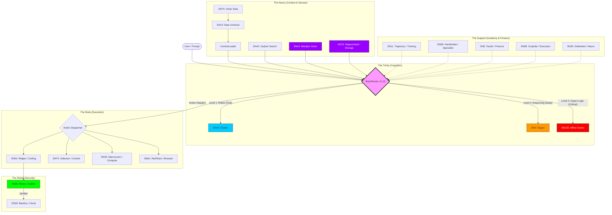

# 🏛️ OpenClaw Sovereign: Arquitetura de Entidade Econômica Autônoma

> **Versão:** 2.2 (Stealth & Audit Edition)
> **Status:** Alpha (Hardened)
> **Ecossistema:** Bittensor (TAO)

## 1. Visão Geral (The Nexus Thesis)

O **OpenClaw Sovereign v2.2** é a resposta definitiva à fragilidade dos agentes de IA tradicionais (e aos riscos expostos pelo incidente "Moltbot").

Enquanto agentes comuns são bloqueados por sites (Cloudflare) e executam códigos inseguros, o Sovereign v2.2 integra um **"Sistema Imunológico" (Bitsec)** e uma **"Máscara Digital" (RedTeam)**. Ele opera como uma Entidade Econômica Autônoma (AEA) que:

1. **Pensa** com eficiência de custo.
2. **Age** sem ser detectada como bot.
3. **Verifica** a segurança do próprio código antes de executar.
4. **Paga** suas contas minerando recursos ociosos.

---

## 🏗️ Arquitetura Visual (The Sovereign Blueprint)



### 1. O Novo Stack Cerebral (A Trindade)

| Nível Cognitivo | Sub-rede Bittensor | Função no OpenClaw |
| :--- | :--- | :--- |
| **Nível 1: Reflexo** | **Chutes (SN64)** | Chat rápido, "Oi", Resumos simples. (Baixo Custo). |
| **Nível 2: Raciocínio** | **Targon (SN4)** | Tarefas complexas, Estratégia padrão. (Custo Médio). |
| **Nível 3: Hiper-Lógica** | **Affine Cortex (SN120)** | **[NOVO]** Problemas críticos, Lógica profunda, Inovação. O "Juiz Supremo". |

### 2. Componentes Funcionais

| Função | Sub-rede (Subnet) | Descrição Tática |
| :--- | :--- | :--- |
| **Lóbulo Frontal** | **Affine (SN120)** | **[NOVO]** Inteligência de elite criada pelo fundador. Para decisões críticas. |
| **Cérebro (Lógico)** | **Targon (SN4)** | O "General". Planejamento estratégico robusto. |
| **Cérebro Blindado** | **Chutes (SN64)** | **[ATUALIZADO]** Executa modelos (Kimi k2.5) em TEEs para dados sensíveis. |
| **Memória (Big Data)** | **Data Universe (SN13)** | **[NOVO]** Acesso a petabytes de histórico da web. |
| **Memória Permanente** | **HippiusVault (SN75)** | **[NOVO]** Armazenamento descentralizado e persistente (Disco Rígido). |
| **Filtro (Qualidade)** | **Clean Data (SN74)** | **[NOVO]** Limpeza de dados (Remove lixo/spam). |
| **Olhos (Visão)** | **Gopher (SN42)** | Busca na web em tempo real. |
| **Olho Mestre (Visão)** | **Manako (SN44)** | **[ATUALIZADO]** Busca e compreensão visual avançada. |
| **Mãos (Skills)** | **Ridges (SN62)** | Criação de ferramentas de código. |
| **Treinamento** | **TrajectoryRL (SN11)** | **[NOVO]** "Dojo" de aprendizado por reforço. |
| **Especialista** | **Handshake (SN58)** | **[NOVO]** Marketplace para modelos de nicho. |
| **Camuflagem** | **RedTeam (SN61)** | Máscara digital para evitar detecção (Anti-Detect v2). |
| **Auditoria** | **Bitsec (SN60)** | Segurança de código (Anti-Exploit). |
| **Execução** | **Basilica (SN39)** | Infraestrutura Serverless para rodar o agente. |
| **Finanças** | **Taoshi (SN8)** | Gestão de ativos e Trading. |
| **Contribuição** | **Gittensor (SN74)** | **[NOVO]** Contribuição Open Source autônoma. |
| **Executor Financeiro** | **Graphite (SN98)** | **[NOVO]** Roteamento inteligente de ordens (Smart Router). |
| **Trader Macro (Forex)** | **0xMarkets (SN35)** | **[NOVO]** Acesso a mercados tradicionais (FX, Commodities) e proteção (Hedge). |
| **Computação** | **Macrocosm (SN25)** | **[NOVO]** Computação Distribuída (Mainframe). |

---

## 3. O Pipeline de Segurança (CI/CD Autônomo)

Na v2.2, nenhum código toca o sistema operacional ("Bare Metal") sem passar por três portões de segurança.

**Fluxo de Criação de Ferramenta:**

1. **Geração (Ridges SN62):** O agente solicita o código.
2. **Auditoria (Bitsec SN60):** O código passa por análise estática.
   * *Falha:* Se contiver vulnerabilidades ou backdoors, é descartado.
   * *Sucesso:* Segue para o próximo passo.
3. **Execução (Basilica SN39):** O código aprovado roda em um container isolado na nuvem.
4. **Resultado:** Apenas o output (texto) retorna ao usuário.

---

## 4. Implementação Técnica dos Novos Módulos

### A. O Camaleão (Adapter RedTeam - SN61)

*Permite que o agente navegue na web como um humano, passando por captchas e WAFs.*

```python
# src/tools/stealth_browser.py
class StealthBrowser:
    def get_mask(self):
        # Solicita um perfil humano válido à SN61
        fingerprint = sn61_client.get_profile()
        return fingerprint # User-Agent, Headers, Cookies

    def browse(self, url):
        mask = self.get_mask()
        # Acessa o site usando a máscara
        return requests.get(url, headers=mask)
```

### B. O Auditor (Adapter Bitsec - SN60)

*A "Polícia do Código" que impede o agente de se auto-destruir.*

```python
# src/security/bitsec_auditor.py
class BitsecAuditor:
    def audit(self, code):
        report = sn60_client.scan(code)
        if report['risk_level'] == 'HIGH':
            raise SecurityException("Código rejeitado pela Bitsec: Risco Alto.")
        return True
```

### C. O Roteador Neural (Brain Router)

*Otimização de custos entre SN4 e SN64.*

```python
# src/core/router.py
def think(prompt):
    complexity = analyze(prompt)
    if complexity == "LOW":
        return chutes_sn64.chat(prompt) # Rápido & Barato
    else:
        return targon_sn4.reason(prompt) # Lento & Profundo
```

---

## 5. Ciclo de Vida de uma Tarefa (Exemplo Real)

**Usuário:** *"Compre o livro 'Bittensor Revolution' na Amazon e me mande o resumo do recibo."*

1. **Targon (SN4)** planeja a tarefa: "Preciso acessar Amazon -> Login -> Comprar."
2. **RedTeam (SN61)** fornece uma identidade de navegador (Fingerprint) para não ser bloqueado pela Amazon.
3. **Ridges (SN62)** gera o script de automação (`selenium` script).
4. **Bitsec (SN60)** audita o script: "Este código envia dados para algum IP estranho? Não. Aprovado."
5. **Basilica (SN39)** sobe um container, executa o script de compra usando a identidade da RedTeam.
6. **Taoshi (SN8)** fornece os fundos (se integrado à carteira).
7. **Resultado:** O OpenClaw entrega o recibo em texto.

---

## 6. Economia (Tokenomics Interno)

O OpenClaw Sovereign v2.2 visa o **Ponto de Equilíbrio (Break-Even)**.

* **Custos:**
    * Inferência (Targon/Chutes)
    * Auditoria (Bitsec)
    * Execução (Basilica)

* **Receitas:**
    * Mineração de Dados (ReadyAI SN33) nas horas ociosas.
    * Yield de Trading (Taoshi SN8).

Se `(Receita Mineração + Yield) > Custos Operacionais`, o agente é economicamente imortal.

---

## 7. Roadmap de Desenvolvimento

* [x] **v2.0:** Integração Targon (Cérebro) e Ridges (Mãos).
* [x] **v2.1:** Integração Basilica (Musculos) e Gopher (Olhos).
* [x] **v2.2 (Atual):** Integração **Bitsec (Auditoria)** e **RedTeam (Furtividade)**.
* [ ] **v3.0:** Interface de Voz Neural em Tempo Real (Possível integração com SN1 ou SN64).

---

## 8. Aviso Legal (Disclaimer)

*A arquitetura Sovereign v2.2 utiliza ferramentas de "Red Teaming" (SN61) e execução de código. O uso do módulo de furtividade para violar Termos de Serviço de sites terceiros é de responsabilidade exclusiva do usuário. O módulo de auditoria (SN60) reduz riscos, mas não garante 100% de segurança.*

---

## 9. Deploy Nativo (Serverless)

Graças à atualização da Basilica (SN39), a infraestrutura física foi abstraída.

**Método:** Container Docker Customizado (`openclaw-sovereign:latest`).

**Provedor:** Basilica Serverless Platform.

**Custo:** Pago em $TAO (Pay-per-use).

**Vantagem:** O agente vive na mesma rede física de alta velocidade onde estão os validadores, reduzindo a latência para Targon (SN4) e Chutes (SN64).

---

**Arquitetado por:** Nexus Bittensor Persona
**Data:** Fevereiro 2026
